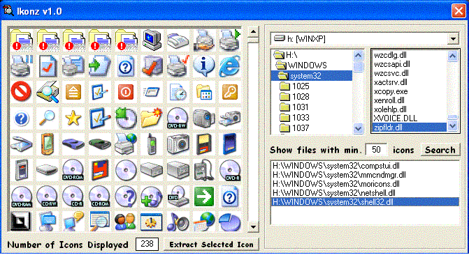



## Ikonz v1\.0

### Description

A unique utilty which will extract hidden ICONS in dll, ocx and Exe files.It also has some cool features.Chek out the screenshot.

I look Forward for your Your Comments and VOTES.
 
### More Info
 

             |
---                |---
**Submitted On**   |2002-07-03 01:23:00
**By**             |[Gaurav Creations](https://github.com/Planet-Source-Code/PSCIndex/blob/master/ByAuthor/gaurav-creations.md)
**Level**          |Beginner
**User Rating**    |4.8 (87 globes from 18 users)
**Compatibility**  |VB 6\.0
**Category**       |[Complete Applications](https://github.com/Planet-Source-Code/PSCIndex/blob/master/ByCategory/complete-applications__1-27.md)
**World**          |[Visual Basic](https://github.com/Planet-Source-Code/PSCIndex/blob/master/ByWorld/visual-basic.md)
**Archive File**   |[Ikonz\_v1\_0101138722002\.zip](https://github.com/Planet-Source-Code/gaurav-creations-ikonz-v1-0__1-36488/archive/master.zip)

